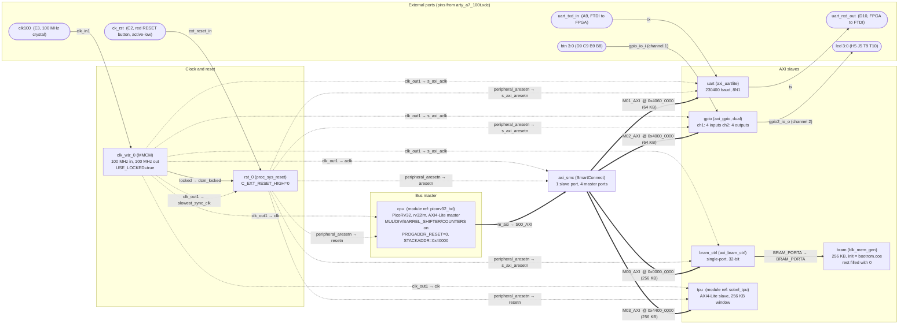
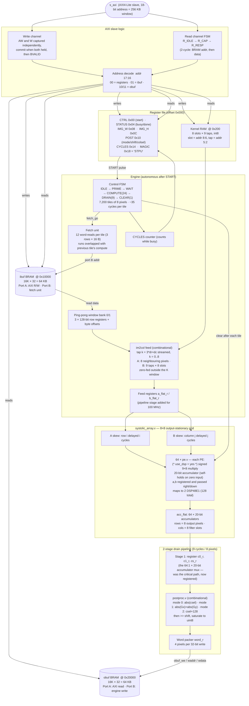

# Q&A — Sobel-TPU: RISC-V SoC + 8×8 Systolic Array Accelerator (Arty A7-100T)

50 questions with rigorous answers, plus the complete architecture diagrams.
Every number here comes from the actual reports in `vivado/reports/` or from the
cycle-accurate full-SoC simulation — nothing is estimated.

**Headline numbers (memorize these):**

| Metric | Value |
|---|---|
| TPU compute, one 240×240 frame | 252,015 cycles = 2.520 ms @ 100 MHz = 4.38 cycles/pixel |
| CPU (same-ISA C baseline) | 71,492,284 cycles = 714.9 ms (1,241 cycles/pixel) |
| CPU (hand-optimized C) | 15,430,757 cycles = 154.3 ms |
| TPU end-to-end (incl. image copy-in) | 998,804 cycles = 9.99 ms (copy-in alone: 746,734) |
| Speedup vs generic C | 283× compute, 72× end-to-end |
| Speedup vs optimized C | 61× compute, 15× end-to-end |
| Throughput | 0.82 GOPS effective, 12.8 GOPS peak |
| Timing | WNS +0.550 ns at 100 MHz (started at −1.369 ns) |
| Area | 4,289 LUTs (6.8%), 4,567 FFs (3.6%), 96 BRAM36 (71.1%), 133 DSP48 (55.4%) |
| Power | 0.486 W total (0.383 dynamic + 0.103 static) |

---

## Section 0 — Architecture diagrams

### 0.1 Complete block design (every cell and every net in `vivado/build_all.tcl`)

Solid double arrows = AXI interface connections. Dashed = clock/reset fan-out.
Every net drawn here corresponds to one `connect_bd_net` / `connect_bd_intf_net`
line in `vivado/build_all.tcl`.

### 0.2 TPU internal structure (`rtl/sobel_tpu.v` + submodules)

---

## Section 1 — Design and architecture decisions

### Q1. Describe the project in one minute.

I built a complete system-on-chip on a Xilinx Artix-7 FPGA (Arty A7-100T) that
filters images two ways and proves the speedup of custom hardware. A PicoRV32
RISC-V soft CPU and my own 8×8 systolic-array accelerator sit on the same
AXI4-Lite bus, in one bitstream. The laptop sends a 240×240 grayscale image and
a set of 3×3 filter kernels over UART; the CPU runs Sobel in C (714.9 ms), then
the accelerator runs the identical math in hardware (2.52 ms compute — 283×
faster). Both results are compared bit-for-bit against a NumPy reference model.
Everything is verified in cycle-accurate simulation of the real RTL and real
firmware, and the design closes timing at 100 MHz with 0.55 ns of slack, using
6.8% of the LUTs, 71% of the BRAM, 55% of the DSPs, at 0.486 W.

### Q2. What is a systolic array, and why use one for convolution?

A systolic array is a grid of small identical processing elements (PEs) where
data flows between neighbours in lockstep, one register per hop, like blood
pulses through a body (hence "systolic"). Each PE does one multiply-accumulate
per cycle and passes its inputs on to the next PE. The key property: **operands
are fetched once and reused many times as they travel across the grid**, so the
memory bandwidth needed is proportional to the array's edge (8+8 values/cycle)
while the compute delivered is proportional to its area (64 MACs/cycle).

Convolution is a perfect fit because it is exactly a large set of
multiply-accumulates with heavy data reuse: every input pixel participates in 9
output pixels, and every kernel tap is used for all 57,600 outputs. A CPU pays
instruction-fetch, loop, and load/store overhead for every single MAC (my
measured C baseline: 1,241 cycles/pixel); the array does 64 MACs every cycle
with zero instruction overhead (4.38 cycles/pixel measured, including all fetch
and drain overheads).

### Q3. Why output-stationary and not weight-stationary?

In a weight-stationary array (like the original Google TPU), the weights are
pre-loaded into the PEs and partial sums flow through — which works when the
reduction dimension K maps onto the physical array dimension. Here K = 9 (a 3×3
kernel has 9 taps) but the array is 8×8: **9 does not fit in 8**, so a
weight-stationary mapping would need to split the reduction and add partial
sums outside the array.

In my output-stationary mapping, each PE *owns one output value*: PE(i,j) holds
the accumulator for output pixel i filtered by kernel slot j. The 9 taps are
streamed *through* the array over 9 cycles (plus skew), and each accumulator
just keeps adding. K becomes the time dimension, so it can be any length — a
5×5 kernel (K=25) would work on the same hardware with zero RTL changes, just
more streaming cycles. That flexibility is exactly why I chose it. One design
subtlety: PEs feed zeros outside the K window, and adding zero is a no-op, so
accumulators "self-hold" without needing a per-PE valid/enable network.

### Q4. How exactly is a 3×3 convolution mapped onto an 8×8 array?

Via **im2col**: convolution is rewritten as a matrix multiply. For a tile of 8
horizontally adjacent output pixels, I form:

- **A (8×9)**: row *i* holds the 9 input pixels under the 3×3 window of output
  pixel *i* (the "im2col patch"),
- **B (9×8)**: column *j* holds the 9 taps of filter slot *j*,
- **C (8×8) = A×B**: element (i,j) is output pixel *i* filtered by kernel *j*.

The array computes C output-stationary: on cycle k (k = 0..8, walking the
kernel as k = 3·dr + dc), pixel row values A[i][k] enter from the left and tap
values B[k][j] enter from the top, with a diagonal skew (row i delayed i
cycles, column j delayed j cycles) so that matching operands meet at PE(i,j) at
the right time. After 9 taps + 15 cycles of skew/pipeline, all 64 dot products
sit in the accumulators. Slot 0 holds Gx, slot 1 holds Gy, and the drain logic
computes |Gx|+|Gy| per pixel. The image is processed as 240/8 × 240 = 7,200
such tiles.

### Q5. Why 8×8, and why INT8 with 20-bit accumulators?

**8×8** balances three constraints. (1) Output width: 240 is divisible by 8, so
tiles pack evenly with no edge remainder. (2) Feed bandwidth: 8 pixels/cycle is
exactly one 3-row window slice I can pull from a 32-bit BRAM in 12 reads per
tile, which hides completely under the 24-cycle compute. (3) It's large enough
to show real speedup (64 MACs/cycle) while leaving the DSP budget comfortable —
128 of 240 DSP48s. A 16×16 array would need 512 DSPs (doesn't exist on this
part) and 4× the feed bandwidth.

**INT8 in, 20-bit accumulate** comes from worst-case analysis, not convention:
pixels are unsigned 8-bit (max 255), taps are signed 8-bit (max magnitude 127),
so one product is ≤ 32,385 and a 9-tap sum is ≤ 9 × 127 × 255 = **291,465 <
2^19**. A signed 20-bit accumulator therefore can never overflow — provable
correctness, no saturation logic needed inside the PE. Images are 8-bit anyway,
so floating point would buy nothing and cost enormous area.

### Q6. Why 240×240 padded to 242×242? Does the design work for other sizes and kernels?

A 3×3 filter needs each output pixel's 8 neighbours, so an *unpadded* 240×240
input would only yield a 238×238 output (border loss). Padding by 1 pixel on
every side (240+2 = 242) gives every output pixel a full window, so **output
size = input size**, which is what you want for image filtering. I pad with
**edge replication** rather than zeros: a zero border looks like a hard
intensity edge to a gradient filter and would draw a bright frame around the
result.

Generality — the hardware is parameterized at runtime: `IMG_W`/`IMG_H`
registers accept any padded size that fits the 64 KB input buffer (up to
~256×256) with the one constraint that (W−2) is a multiple of 8 (tile width).
The kernel is not hardcoded at all — 8 slots × 9 signed taps are written over
AXI, so blur, sharpen, Laplacian, emboss all run on the same bitstream. Larger
kernels (5×5) would need only a change to the tap-walk counter, because
output-stationary streaming makes K a time dimension (see Q3). Larger images
need either bigger BRAMs or row-streaming — see Q50.

---

## Section 2 — AXI4-Lite

### Q7. How does AXI4-Lite work?

AXI4-Lite is the simplest AMBA AXI variant: memory-mapped single-beat reads and
writes, no bursts, no IDs, fixed data width (32-bit here). It has **five
independent channels**, each a one-way street with its own VALID/READY
handshake:

1. **AW** — write address (master → slave)
2. **W** — write data + byte strobes (master → slave)
3. **B** — write response (slave → master)
4. **AR** — read address (master → slave)
5. **R** — read data + response (slave → master)

The handshake rule is the heart of it: a transfer happens on the clock edge
where **VALID and READY are both high**. VALID must not wait for READY (no
deadlock by design), and once VALID is asserted, the payload must stay stable
until the handshake completes. A write is complete when the slave has seen
*both* AW and W (they may arrive in either order!) and has returned B. A read
is AR in, R back. Decoupled channels mean masters and slaves of very different
speeds compose safely — the interconnect just carries handshakes.

### Q8. Why AXI4-Lite and not full AXI4 or AXI-Stream?

Because the accelerator is a **slave with its own local memory**, and every
transaction on the bus is a register access or a buffer word — single-beat by
nature. Full AXI4 adds bursts, out-of-order IDs, and exclusive access; all that
machinery would buy nothing here (the CPU, PicoRV32, issues single beats
anyway) and costs area and verification effort. AXI-Stream would fit a
flow-through pipeline without addressing, but I deliberately gave the TPU
addressable buffers so the CPU can read back and verify any word, and so no DMA
engine is required for a working system. The honest cost of that choice is
copy-in time (Q11); the honest defense is that it's the right
simplicity/performance trade for a 64 KB image, and the register map makes the
IP trivially controllable from 20 lines of bare-metal C.

### Q9. How does your TPU implement the AXI-Lite slave? Walk through the RTL.

Writes: AW and W are captured **independently** into `awaddr_r`/`wdata_r` with
`aw_got`/`w_got` flags (because a master may send them in either order — this
is the classic AXI-Lite slave bug if you assume same-cycle arrival). When both
flags are set, the write "commits" in one cycle: the decoder fires
(`wr_regs`/`wr_ibuf`), flags clear, and `BVALID` is raised until the master
accepts with `BREADY`. `AWREADY`/`WREADY` are held low while a response is
pending, giving natural back-pressure.

Reads: a 3-state FSM — `R_IDLE` (accept AR, latch address), `R_CAP` (BRAMs are
synchronous, so this cycle the addressed BRAM's registered output becomes
valid; select register/ibuf/obuf data into `s_axi_rdata`), `R_RESP` (hold
`RVALID` until `RREADY`). That deliberate 2-cycle read pipeline is what lets the
buffers be true block RAM instead of LUT RAM. Both responses are always OKAY
(`2'b00`); writes to read-only offsets are simply ignored — acceptable for a
closed embedded system, and I can say so explicitly.

### Q10. How is the 256 KB window decoded inside the TPU?

The slave sees an 18-bit byte address (2^18 = 256 KB, matching the block
design's `-range 256K`). Top two bits `addr[17:16]` split the window into three
regions:

- **`00` → registers**: `addr[9]` picks kernel RAM vs control registers. For
  kernels, slot = `addr[8:6]` (8 slots, 0x40 apart) and tap = `addr[5:2]` (9
  taps, word-addressed) — so `TPU_KER(s,t) = 0x200 + s*0x40 + t*4` in the C
  header. For control, `addr[4:2]` indexes CTRL/STATUS/IMG_W/IMG_H/POST/CYCLES/MAGIC.
- **`01` → input buffer**: `addr[15:2]` is the word index into the 16K×32 BRAM
  (242×242 pixels, 4 pixels per word, little-endian).
- **`10`/`11` → output buffer**: same indexing, read-only.

MAGIC (0x18) returns 0x53545055 ("STPU") — the firmware reads it at boot as a
liveness/address-map sanity check before touching anything else. That one
register has saved hours of debugging in bring-up flows.

### Q11. The CPU copies the image into the TPU word-by-word. Why no DMA, and what does it cost?

Measured cost: **746,734 cycles** to copy 14,641 words — about 51 cycles per
32-bit AXI write, which is the PicoRV32's load-store cost plus interconnect
latency, times 14,641. That's 74.8% of the 998,804-cycle end-to-end time; the
actual compute is only 252,070.

I kept it CPU-driven deliberately: a DMA needs the TPU to be an AXI *master*
(or a separate DMA IP), arbitration on the bus, and descriptor management in
firmware — significant complexity for a first-silicon-style bring-up, and it
would not change the headline compute number, which is measured by the TPU's
own hardware cycle counter. The design is honest about it: I quote both 283×
(compute) and 72× (end-to-end including copy). The fix is well understood and
scoped: add an AXI master read port or ping-pong the input buffer so copy of
frame N+1 overlaps compute of frame N — at which point end-to-end converges to
compute time. Being able to explain *why* the gap exists and *how* to close it
is worth more than hiding it.

---

## Section 3 — Block design and IPs

### Q12. What IPs did you use, with what configuration, and why?

Seven blocks — five Xilinx IPs and two of my own modules:

1. **clk_wiz (MMCM)** — 100 MHz in → 100 MHz out, `USE_LOCKED=true`. Not a
   passthrough: it cleans the clock, gives a `locked` signal for reset
   sequencing, and makes retargeting to another frequency a one-parameter
   change (my documented fallback if timing hadn't closed was 50 MHz here).
2. **proc_sys_reset** — `C_EXT_RESET_HIGH=0` because the Arty reset button is
   active-low. Synchronizes the async button and MMCM `locked` into a clean,
   synchronous, active-low `peripheral_aresetn` for every block. Never
   distribute a raw button as reset — release must be synchronous to avoid
   flops coming out of reset on different cycles.
3. **SmartConnect** — 1 slave × 4 master ports; the address decoder/router of
   the system. Chosen over the older `axi_interconnect` as it's the current,
   timing-friendlier fabric.
4. **axi_bram_ctrl** (single-port, 32-bit) + **blk_mem_gen** (256 KB,
   `Load_Init_File=true` with `bootrom.coe`, remaining locations zero-filled) —
   CPU code/data RAM whose power-on contents *are* the boot ROM. This pairing
   is the standard way to get AXI-addressable initialized BRAM.
5. **axi_uartlite** — 230400 baud, 8 data bits. Picked over the full 16550 for
   its 4-register simplicity; 230400 is a reliable rate for the on-board FTDI.
6. **axi_gpio** — dual-channel: channel 1 = 4 buttons (all inputs), channel 2 =
   4 LEDs (all outputs). One IP instead of two saves a SmartConnect port.
7. **cpu (picorv32_bd)** and **tpu (sobel_tpu)** — my own Verilog, added as
   module references (Q13).

### Q13. How did you turn your own RTL into something usable in the block design? ("How did you make it an IP?")

Vivado offers two routes and I used the lighter one: **Module Reference** (Add
Module) rather than the full "Package IP" flow. You add the plain `.v` file to
the project and drop the module into the block design; Vivado then **infers the
interfaces from port naming**: because my ports are named exactly
`s_axi_awaddr, s_axi_awvalid, … s_axi_rready`, IPI recognizes them as one
AXI4-Lite slave interface and draws a single bus pin. Two attributes finish the
job: `X_INTERFACE_INFO` on `clk` and `resetn` declare them as clock/reset
signals, and `X_INTERFACE_PARAMETER` states `ASSOCIATED_BUSIF s_axi` (which
clock the bus belongs to) and `POLARITY ACTIVE_LOW` for reset. After that the
module connects, address-maps, and validates exactly like a packaged IP.

The same trick wraps the CPU: `picorv32_bd_wrapper.v` instantiates
`picorv32_axi` with my chosen parameters (rv32im, fast multiplier, barrel
shifter, 64-bit cycle counters, reset vector 0, stack at 0x40000) and exposes
clean `m_axi_*` ports so IPI infers an AXI master. Package IP would add
versioning, a GUI config wizard, and a reusable IP catalog entry — worth it for
IP you ship to other teams, overkill for IP living in one repo.

### Q14. How did you know what to connect where in the block design?

There's a methodology, not guesswork — four rules cover everything:

1. **Dataflow defines the bus topology.** One initiator (CPU) must reach four
   targets (RAM, UART, GPIO, TPU) → one 1×4 interconnect, CPU `m_axi` into its
   slave side, each peripheral's `s_axi` on a master port. Memory-mapped buses
   are always master→interconnect→slaves.
2. **Every synchronous block gets the same clock**, from one source:
   `clk_wiz_0/clk_out1` fans out to all `clk`/`aclk`/`s_axi_aclk` pins. Single
   clock domain = zero clock-domain-crossing bugs, one timing constraint.
3. **Reset follows the clock**: `proc_sys_reset` takes the external button and
   `locked`, and its `peripheral_aresetn` output drives every block's reset.
   Reset must not release until the clock is stable — that's exactly the
   `dcm_locked` input's job.
4. **Board I/O comes from the schematic**: UART crosses over (FTDI TX → FPGA
   `rx`; naming on the Arty is from the FTDI's perspective, so `uart_txd_in`
   is FPGA input), buttons → GPIO channel-1 inputs, LEDs ← GPIO channel-2
   outputs.

After wiring, `validate_bd_design` mechanically checks the rest — unconnected
pins, clock/reset associations, address gaps. The whole design is also built
programmatically in `build_all.tcl`, so every connection is a reviewable line
of Tcl rather than an undocumented GUI click.

### Q15. How does address assignment work, and what did you set?

Every AXI master has an *address space*; every slave exposes *segments*. The
Address Editor (or `assign_bd_address` in Tcl) places each segment at an offset
and range inside the master's space; SmartConnect then decodes the high address
bits of each transaction and routes it to the matching master port. My map:

| Segment | Base | Range | Why there |
|---|---|---|---|
| bram_ctrl (RAM + boot ROM) | 0x0000_0000 | 256 KB | PicoRV32's reset PC is 0 — code must live at 0 |
| gpio | 0x4000_0000 | 64 KB | conventional peripheral region |
| uart | 0x4060_0000 | 64 KB | Xilinx's customary uartlite base |
| tpu | 0x4400_0000 | 256 KB | 256 KB window = 18 address bits for regs + two 64 KB buffers |

The exact same constants live in `fw/soc.h` — hardware and firmware share one
source of truth, and the firmware verifies it at boot via the MAGIC register.
One practical lesson: for module-reference blocks I had to use explicit
`assign_bd_address -target_address_space … -offset … -range` in Tcl, because
segment-name glob patterns that work for packaged IPs don't match
module-reference segment names.

### Q16. How does pin planning work? How did you know which pins to use?

Pins are bound by the **XDC constraints file**, one `set_property` pair per
port: `PACKAGE_PIN` (which physical ball) and `IOSTANDARD` (voltage/driver
standard, LVCMOS33 here since all these banks are 3.3 V on the Arty). The
authoritative source is the **board schematic / Digilent's master XDC**: the
100 MHz oscillator drives ball **E3**, the reset button **C2**, the FTDI UART
bridge **A9** (into FPGA) and **D10** (out), buttons **D9/C9/B9/B8**, LEDs
**H5/J5/T9/T10**. You uncomment/rename the master-XDC lines to match your
top-level port names — the critical detail being that port names in the XDC
must exactly match the block-design wrapper's ports.

Two more constraints complete the file: `create_clock -period 10.000` on
`clk100` (without it there is *no* timing analysis at all — an unconstrained
design "passes" vacuously), and `set_false_path` on the asynchronous inputs
(buttons, UART rx) which have no defined timing relationship to the clock.
Plus `CFGBVS VCCO` / `CONFIG_VOLTAGE 3.3`, which silence the configuration-bank
voltage DRC. If I ever used a pin not on a header, `report_io` and the package
view are the checking tools — for this project all 12 pins came straight from
the board files.

### Q17. Why a clocking wizard and a reset block instead of using the crystal and button directly?

You *can* clock fabric straight from an input buffer, but the MMCM gives four
things that matter: de-skewed, low-jitter distribution onto the global clock
tree; a `locked` status output; frequency synthesis (one parameter to retarget
the whole SoC — my documented timing fallback was to re-generate at 50 MHz);
and a legal place to add more clocks later. The number shows up in the power
report — the MMCM costs 0.106 W, a real price I can point to and justify.

The button, used raw, has two hazards: it's mechanically bouncy and it's
asynchronous. If reset releases near a clock edge, different flip-flops can
leave reset on different cycles and the machine wakes up in an inconsistent
state (a form of metastability failure). `proc_sys_reset` synchronizes the
release to the clock, stretches the pulse, gates it with MMCM `locked` so
nothing runs on an unstable clock, and provides both polarities. It's four
slices of insurance against the least-debuggable class of failure.

---

## Section 4 — TPU RTL internals

### Q18. Walk me through what happens in the TPU from START to DONE.

Firmware writes IMG_W=242, IMG_H=242, POST=(mode 1, shift 0), loads kernel
slots, then writes CTRL=1. The `start_pulse` fires only if not busy, and the
FSM leaves IDLE:

- **S_PRIME** (1 cycle): compute `ntiles = tiles_row × out_rows` = 30 × 240 =
  7,200 (this multiply is the TPU's 129th DSP), kick the first fetch.
- **S_WAIT**: until the fetch unit has banked tile N's window; simultaneously
  launch the fetch of tile N+1 (the overlap that hides all fetch time).
- **S_COMPUTE** (24 cycles): stream taps k=0..8 through the feed registers into
  the skewed array; cycles 9–23 are skew/pipeline flush (8 rows + 8 columns of
  skew + 1 feed register).
- **S_DRAIN** (9 cycles): 2-stage pipeline — stage 1 registers the selected
  accumulators for pixel *i*, stage 2 post-processes pixel *i−1* and packs 4
  pixels per 32-bit word into the output BRAM.
- **S_CLEAR** (1 cycle): zero all 64 accumulators, bump `tile_cnt`; back to
  S_WAIT, or set DONE and drop BUSY after tile 7,200.

That's 35 cycles per 8-pixel tile: 7,200 × 35 = 252,000, plus 15 cycles of
priming = **252,015**, exactly what the hardware CYCLES register and both
simulations report. I can account for every cycle — that's the sentence I want
an interviewer to remember.

### Q19. How does the ping-pong prefetch work, and what would it cost not to have it?

Each tile needs a 3-row × 16-byte input window = 12 32-bit BRAM reads. The
fetch unit and the compute engine index a 2-entry bank array with opposite
parity bits (`f_cnt[0]` vs `tile_cnt[0]`): while the array computes tile N out
of bank 0, the fetch unit fills bank 1 with tile N+1's window, and they swap.
The fetch takes ~13 cycles, the compute+drain takes 34, so fetch is *entirely*
hidden — the engine never stalls on memory after the first tile.

Without it, each tile would serialize 13 fetch + 34 compute = 47 cycles, i.e.
~338K cycles per frame instead of 252K — a 34% slowdown from a couple of
128-bit registers. It's the textbook double-buffering pattern, and it's also
why I can claim the memory system is *not* the bottleneck at this scale. A
detail worth mentioning: rows are byte-addressed but BRAM is word-addressed, so
each banked row stores a 2-bit byte offset (`boff`) used by the feed muxes —
that unaligned-access handling is where the real design effort was.

### Q20. What is inside one PE, and why does it map to two DSP48s?

`pe.v` is deliberately tiny: registered pass-throughs `a_out <= a_in`, `b_out
<= b_in` (the systolic movement), a signed multiply of the 9-bit pixel operand
(8-bit unsigned pixel zero-extended to stay non-negative in signed arithmetic)
by the 8-bit signed tap, and a 20-bit accumulator `acc <= clear ? 0 : acc +
sign_extend(prod)`. No enable, no valid: operands are zero outside the active
window and adding zero holds the value.

The module carries `(* use_dsp = "yes" *)`. In the routed design each PE
occupies **2 DSP48E1s** (64 PEs → 128; +1 for the FSM's `ntiles` multiply and
+4 in the PicoRV32 fast multiplier = the 133 in the report). Two per PE because
I register the product (`prod`) and then accumulate — Vivado maps the multiply
into one DSP's multiplier/M-register and the 20-bit accumulate into a second
DSP's ALU, cascading them. A single DSP48E1 *can* do multiply-accumulate in one
block; collapsing to that would halve DSP count at the cost of re-checking the
accumulator timing — a concrete optimization I can name but didn't need at 55%
utilization.

### Q21. What does the diagonal skew in the array actually do?

In a systolic matrix multiply, PE(i,j) must see A[i][k] and B[k][j] *in the
same cycle* for every k — but A values enter only at the left edge and B values
only at the top, taking i and j hops respectively to arrive. Without
compensation, operands would meet misaligned and the dot products would be
garbage. The fix is classic: delay row i's input stream by i cycles and column
j's by j cycles (`systolic_array.v` builds these shift registers with generate
loops). Then A[i][k] reaches PE(i,j) at time k+i+j — exactly when B[k][j] does.
The last PE (7,7) finishes 14 cycles after the first, which is why COMPUTE is
9 taps + 15 flush cycles, and it's also why the whole thing needs only
edge-feeding: 8+8 values per cycle feed 64 MACs per cycle.

### Q22. How does the post-processing unit work, and why is it in hardware?

`postproc.v` is a small combinational block applied to each pixel during drain.
Three modes (from the POST register): mode 0 = |c_sel| (absolute value of any
one selected filter column — used for single-kernel filters), mode 1 =
|c0| + |c1| (the Sobel gradient magnitude approximation |Gx|+|Gy|), mode 2 =
c_sel + 128 (bias for signed outputs like Laplacian, so they're viewable as
unsigned images). The result is right-shifted by a programmable amount (a
cheap divide for kernels with gain, e.g. a box blur) and saturated to 0..255.
The additions are done at 21 bits so |Gx|+|Gy| cannot wrap before saturation.

Why hardware: if the array returned raw 20-bit signed Gx and Gy, the CPU would
touch every pixel again (defeating the accelerator), and the readback would be
2×20-bit per pixel instead of 8. Fusing abs/add/shift/saturate into the drain
costs a handful of LUTs, runs in the pipeline shadow, and makes the output
buffer directly displayable. The exact true magnitude √(Gx²+Gy²) needs a
square root; |Gx|+|Gy| is the standard hardware approximation, and my golden
model defines it as the spec so RTL, C, and Python all agree bit-for-bit.

---

## Section 5 — Verification

### Q23. What does "results verified bit-exact against a NumPy golden model" actually mean?

It means there is a single executable specification — `host/golden.py` — that
defines the *exact integer arithmetic* of the whole pipeline: cross-correlation
accumulation (`acc = Σ k[3dr+dc] · img[y+dr][x+dc]`), the |Gx|+|Gy| post-op,
shift, and saturation, all in Python/NumPy integers. When an image is prepared,
this model produces `golden_int.bin`: 57,600 expected output bytes.

Every implementation is then compared **byte-for-byte** against that file: the
TPU RTL simulation output, the full-SoC simulation's TPU output, and the C
software's output (both the generic and optimized versions). "Bit-exact" means
`memcmp` equality on all 57,600 pixels — not "close", not PSNR-similar,
*identical*. This is a much stronger claim than visual correctness: any
off-by-one in an address calculation, a sign-extension bug, a saturation edge
case, or a misaligned byte lane produces at least one differing byte and fails
the check. It also makes the CPU-vs-TPU benchmark fair by construction — both
run provably the same computation, so the 283× is speedup on identical work.

### Q24. Describe your verification strategy — the levels.

Three levels, each catching a different class of bug:

1. **Golden model first** (`golden.py`) — written before any RTL, so the spec
   exists independently. It also validates itself visually: PSNR against a
   floating-point Sobel reference confirms the integer pipeline is a sane
   filter (Q27).
2. **Unit level** (`sim/tb_tpu.v`, Icarus Verilog): the real `sobel_tpu` alone,
   driven by an AXI4-Lite bus-functional model — reusable `axi_write`/`axi_read`
   tasks that implement proper VALID/READY handshakes. The testbench loads the
   real prepared image into the input buffer, programs real kernels, starts the
   engine, dumps the output buffer, and compares to golden. Result: bit-exact,
   252,015 cycles.
3. **System level** (`sim/tb_soc.v`, Verilator): the **real** PicoRV32 core RTL
   executes the **real compiled firmware** (same C, same rv32im toolchain) from
   a behavioral memory with realistic read wait-states, talks through real AXI
   handshakes to the **real** TPU RTL. It runs the entire benchmark — generic C
   Sobel, optimized C Sobel, TPU copy-in + run — and both output images are
   dumped and compared to golden. This is where all the cycle counts on the CV
   come from.

The pattern to state explicitly: *simulate the same RTL and the same binary
that go to the board*, so the board can only differ in wall-clock, not
behavior.

### Q25. What exactly is "full-SoC simulation"? What's real and what's behavioral?

**Real (identical to what synthesizes into the bitstream):** `picorv32.v` (the
actual upstream core, same parameters as the block design), all four TPU RTL
files, the firmware binary compiled by the same riscv64-unknown-elf-gcc with
the same flags. **Behavioral (testbench stand-ins):** the RAM (a Verilog array
initialized from the firmware hex, with 3 read wait-states to approximate the
BRAM-through-SmartConnect latency), a UART transmit register that prints to the
console, and a sim-only control port the firmware writes to tell the testbench
where result buffers live and when to dump them (`#ifdef SIM` in `main.c`).

So the simulation boots the CPU at PC=0, runs C code that polls status
registers, does the word-by-word AXI image copy, spins on the TPU DONE bit —
every instruction and every bus handshake is cycle-accurate. What it does *not*
model: the exact SmartConnect internal pipeline depth and the UART's physical
baud timing. That's why the CPU-observed TPU numbers could shift by a percent
or two on silicon, but the TPU's *own* hardware counter (252,015) is exact by
construction — the engine is deterministic once started, with zero
bus interaction until DONE.

### Q26. Why Verilator and not Icarus for the SoC simulation?

Scale. The CPU baseline alone is ~71M cycles; the whole benchmark is ~90M.
Icarus Verilog is an *interpreting* event-driven simulator — excellent for the
small TPU-only bench (which I did run under Icarus) but I measured it heading
toward hours on the SoC run and killed it. Verilator **compiles** the Verilog
to optimized C++ (`--binary --timing`), which is typically 100×+ faster for
synthesizable RTL: the full 90M-cycle benchmark completes in **under a
minute**. That speed changed the engineering loop — after each timing fix that
touched the pipeline (Q30, Q31), re-verifying bit-exactness across the whole
SoC took a minute, so there was never a temptation to skip re-verification.
Trade-offs I can name: Verilator is two-state (no X-propagation) and covers the
synthesizable subset, so the delay-rich Icarus bench stays useful at unit
level. Using both, each where it's strong, was the pragmatic choice.

### Q27. If everything is bit-exact, what role does PSNR play?

Two different questions, two different metrics. **Bit-exactness** answers "does
the hardware compute the specified function?" — implementation correctness.
**PSNR** answers "is the specified function a *good Sobel filter*?" — algorithm
quality. My integer pipeline makes approximations: luma conversion, uint8
quantization, and |Gx|+|Gy| instead of √(Gx²+Gy²). PSNR of the integer result
against a float64 √(Gx²+Gy²) reference on the real photo came out **~29.1 dB**,
which for an edge map means visually indistinguishable structure — it validates
that the approximations were benign. Without this check, I could be perfectly
bit-exact against a *wrong* spec. One layer deeper: the golden model itself was
eyeballed as PNG output on real photos before freezing it as the spec —
"verify the spec, then verify against the spec."

---

## Section 6 — Timing closure

### Q28. How do you read a timing report? What are WNS, TNS, WHS, WPWS?

`report_timing_summary` checks every register-to-register path against the
clock constraint (10 ns here). For each path: *arrival time* (clock edge +
clock network delay + logic delay + routing delay) versus *required time* (next
clock edge − setup time − clock uncertainty). **Slack = required − arrival**;
negative slack means that path physically cannot make the cycle time.

- **WNS** (worst negative slack): the single worst setup path. My final value:
  **+0.550 ns** over 16,262 endpoints, 0 failing — meaning the design could in
  principle run at 1/(10 − 0.55) ≈ 105.8 MHz.
- **TNS**: the sum of all negative slacks — tells you whether a failure is one
  stubborn path or an epidemic. Mine: 0.000.
- **WHS** (worst hold slack): the *minimum*-delay check — data must not race
  through and corrupt the *same* edge's capture. Mine: +0.025 ns. Hold
  violations are worse than setup ones: you can't fix them by slowing the clock.
- **WPWS** (worst pulse width slack): clock high/low time and
  max-frequency-of-primitive checks (e.g., BRAM clock limits). Mine: +3.000 ns.

The report's closing line, "All user specified timing constraints are met," is
only meaningful because the clock is actually constrained (`create_clock`
period 10) — an unconstrained design reports nothing and proves nothing.

### Q29. How did you find the critical paths?

The timing report names them precisely — the skill is reading the path detail
and translating netlist names back to RTL intent. Each failing path lists the
start register, end register, every LUT/net hop with incremental delay, the
**logic-level count**, and the logic-vs-routing delay split. My diagnosis
process: take the top handful of `report_timing -max_paths` entries, group by
endpoint, and ask *what architectural structure is this?*

First failure: start `post_colsel_reg`, end `word_r_reg`, ~15 logic levels —
those names told me it was the drain: POST's column-select feeding the 64:1 ×
20-bit accumulator mux, through postproc, into the word packer — an enormous
combinational cone in one cycle (Q30). Second: start `tile_cnt_reg`, end a PE
accumulator — the ping-pong *select bit* (`tile_cnt[0]`) rippling through the
bank mux, the unaligned byte mux, and into PE(0,0)'s multiply (Q31). High
logic-levels ⇒ restructure/pipeline; low levels but ~90% routing delay ⇒
placement/congestion, a different fix. Both of mine were the first kind.

### Q30. First timing failure: −1.369 ns. What was the path and the fix?

The path: during drain, one cycle did *everything* — select one pixel's Gx and
Gy out of 64 20-bit accumulators (a 64:1×20-bit mux tree), then absolute
values, a 21-bit add, shift, saturate, then steer the byte into the packing
register. Fifteen levels of logic; at ~0.5–0.9 ns per LUT+route hop, that's
simply more than 10 ns of work.

Fix: **cut the cone in half with a pipeline register** — the standard timing
weapon. Drain became two stages: stage 1 only does the accumulator selection
and registers three 20-bit values (`c0_r`, `c1_r`, `cs_r`); stage 2 runs
postproc and packs, operating on the *previous* cycle's selection (`d_i`
counts 0..8; stage 2 emits pixel `d_i−1`). Drain went from 8 to 9 cycles per
tile — 7,200 extra cycles per frame, +2.9% latency — and the huge mux got a
full cycle to itself. Crucially, a pipeline register changes *when* values
appear, never *what* they are, and I re-proved that: full re-simulation after
the change, still bit-exact (Q32).

### Q31. Second failure: −0.884 ns, and only 5 DSPs in use. What happened?

Two findings from one report. The remaining critical path started at
`tile_cnt_reg`: the low bit selects which ping-pong bank the compute side
reads, and that select propagated through the 128-bit bank mux, the byte-offset
mux (unaligned rows, Q19), and *into the PE array's multiplier input* — control
logic and datapath fused into one long cone. Second finding, from the
utilization report: only **5 DSP48s** were in use. Vivado's automatic DSP
inference has size thresholds, and my 9×8-bit multiplies fell *below* them —
all 64 multipliers had been built out of fabric LUTs and carry chains, which is
both slower and area-hungry.

Two fixes together: `(* use_dsp = "yes" *)` on the `pe` module, forcing every
multiply-accumulate into DSP48 blocks (hard silicon, internally pipelined —
this is the "forced the mapping" line on my CV), and a **registered feed**:
`a_flat_r`/`b_flat_r` flops between the feed muxes and the array, cutting the
bank-select cone off from the datapath. The register delays both operand
streams by one cycle *uniformly*, so systolic alignment is preserved — only the
COMPUTE count changed from 23 to 24. Result: WNS **+0.550 ns**, DSPs 5 → 133.

### Q32. Why doesn't adding pipeline stages change the results, and how did you prove it?

Argument first, proof second. A pipeline register inserted on a feed-forward
path adds latency but computes the same function — *provided* every parallel
path it must stay aligned with is delayed equally, and the control counts are
retimed to match. Both my insertions respect that: the drain register delays
Gx, Gy, and c_sel identically with the emit index following one behind; the
feed register delays operand streams A and B identically (skew preserved:
delaying *all* inputs by one cycle shifts every PE's schedule by one cycle),
with COMPUTE extended by exactly one count. The one hazard I had to check: the
accumulators must not receive stale nonzero data around the clear — handled by
gating the feed registers to zero on `arr_clear`.

Proof: after each change, re-run the **entire** verification stack — TPU-only
sim bit-exact vs golden (cycle count moved 244,815 → 252,015, exactly the
predicted 7,200+ cycles), then the full-SoC Verilator run, both CPU and TPU
outputs still bit-exact on the real photo. Verification isn't a phase at the
end; it re-runs after every optimization, which is precisely why the sub-minute
Verilator loop (Q26) mattered.

### Q33. What is the critical path now, after closure?

Worth knowing because it shows the *logic* is no longer the limit. The routed
design's worst setup path (slack +0.550 ns) runs from an address register in
`axi_bram_ctrl` to the address port of one of the 64 boot-ROM RAMB36 primitives
— **zero logic levels**, 8.715 ns of delay that is **94.8% routing**. A 256 KB
memory occupies 64 physical BRAM columns spread across the die, so the
controller's address bus must fan out over long routes; the report even shows
the compensating clock-skew arithmetic. My TPU paths are comfortably faster
after the two pipeline fixes. If I needed another 50 MHz, the report tells me
exactly where to work: register the BRAM address fan-out or let the tool
replicate the address register — not more TPU pipelining. Reading *where the
slack went* is as important as the WNS headline.

---

## Section 7 — Resource estimation and the utilization report

### Q34. How do you estimate LUT/BRAM/DSP needs *before* synthesis?

Work the architecture against the datasheet, resource class by resource class,
because each has a different (and differently accurate) estimation rule:

- **BRAM — exact by arithmetic.** Memories are decided by the memory map, and
  the mapping to RAMB36 primitives (36 Kb each) is deterministic: capacity ÷
  36 Kb, respecting width. This never surprises you (Q35).
- **DSP — exact by counting multipliers.** Every multiply in the datapath is
  countable from the block diagram: 64 PEs × their MACs, plus the CPU's
  multiplier, plus stray control multiplies. DSP48E1 handles up to 25×18
  signed; anything smaller fits in one (or the tool splits mult/accumulate
  across two, as here — Q36).
- **LUT/FF — order of magnitude only.** Use known reference points: a PicoRV32
  with MUL/DIV is ~1.5–2K LUTs (documented), a SmartConnect port ~400–500, an
  AXI-Lite register file a few hundred, muxes ≈ width × inputs/2 LUTs. I
  budgeted "a few thousand against 63,400 available" — i.e., establish that
  LUTs are *not* the binding constraint, and let the report refine it.

Then the loop: synthesize early, `report_utilization`, compare against the
estimate, and **investigate every mismatch** — that's how the 5-DSP anomaly
(Q31) was caught. Estimate → measure → explain deltas; the explaining is where
the engineering is.

### Q35. Justify the 96 BRAMs exactly.

Three memories, all sized by the memory map, all confirmed by the hierarchical
report:

| Memory | Size | Organization | RAMB36 |
|---|---|---|---|
| CPU RAM + boot ROM (`blk_mem_gen`) | 256 KB | 65,536 × 32 | **64** |
| TPU input buffer (`ibuf`) | 64 KB | 16,384 × 32 | **16** |
| TPU output buffer (`obuf`) | 64 KB | 16,384 × 32 | **16** |

Each RAMB36 is 36 Kb ≈ 4 KB of usable 32-bit storage (1K × 36 mode): 256/4 =
64, 64/4 = 16, 16 — total **96 of 135 (71.1%)**, and the hierarchy report shows
exactly 64 under `bram` and 32 under `tpu`. BRAM is my *scarcest* resource, and
that was a conscious sizing decision: 64 KB buffers hold a padded 242×242 image
(58,564 B) with headroom, and 256 KB CPU RAM holds firmware + a full input and
output image in C arrays. It also quantifies the portability limit: the
A7-35T has only 50 BRAMs, so this exact configuration cannot fit there — the
resource budget is what tells you which board to buy *before* buying it.

### Q36. Justify the 133 DSPs exactly.

From `utilization_hier.rpt`, to the block:

- **128** = 64 PEs × 2 DSP48E1 each. Each PE's registered multiply goes into
  one DSP (multiplier + M register) and its 20-bit accumulator into a second
  DSP's ALU, cascaded. Visible per-instance in the report:
  every `g_row[i].g_col[j].u_pe` shows exactly 2.
- **1** in the TPU control: the FSM's `ntiles = tiles_row × out_rows` multiply
  in S_PRIME.
- **4** in the PicoRV32's `pcpi_fast_mul` (the 32×32 multiplier the rv32im
  `MUL` instruction uses — also why the *CPU* baseline is fast at
  multiply-heavy code).

Total 133 of 240 = **55.4%**. Two follow-ups I can answer: (1) before
`use_dsp`, this number was 5 — the array was in fabric (Q31), so the DSP count
is itself evidence the mapping is now correct; (2) it could be reduced to ~69
by fusing each PE's multiply-accumulate into a single DSP48E1's M+ALU path —
a known optimization I didn't need at this utilization.

### Q37. Where do the 4,289 LUTs go? Walk through the utilization report.

Top-level summary: 4,289 slice LUTs (6.76% of 63,400) — 4,184 as logic, 105 as
memory (44 distributed-RAM, 61 shift-register) — plus 4,567 flip-flops, 280
F7 + 112 F8 muxes, 2,003 occupied slices (12.6%), 2 BUFGs, 1 MMCM, 12 IOBs.
The hierarchical report breaks it down:

| Block | LUTs | FFs | Notes |
|---|---|---|---|
| tpu | 2,081 | 2,806 | array 1,039 (mostly skew/feed; PE logic is in DSPs), rest = AXI slave, FSM, fetch, drain |
| cpu | 1,433 | 832 | core 884, divider 341, fast multiplier 204 |
| axi_smc | 456 | 531 | interconnect/decoder |
| bram_ctrl | 156 | 173 | AXI→BRAM protocol |
| uart + gpio + rst | ~144 | ~217 | small peripherals |

The F7/F8 muxes and the TPU's high FF count are signatures of the accumulator
fan-in and the pipeline registers added for timing. The honest headline: **the
accelerator costs ~2K LUTs of control to harness 128 DSPs** — the array itself
is nearly free in fabric because the arithmetic lives in hard silicon. And with
6.8% LUT usage, routing pressure is low, which is part of why timing closed
with slack.

### Q38. What would you have done if the design hadn't fit?

In order of preference, because each step costs something different:

1. **Re-check inference before cutting features** — the 5-DSP incident is the
   proof case: the "shortage" may be the tool mapping to the wrong resource.
   Same for BRAM vs LUT-RAM decisions.
2. **Trade resource classes**: BRAM was my tight one (71%). The output buffer
   could go 9-bit-per-pixel... no — could halve by packing, or the CPU RAM
   could drop to 128 KB (firmware uses far less) freeing 32 BRAMs at the cost
   of image-in-RAM headroom.
3. **Shrink the compute geometry**: a 4×8 array halves DSPs and roughly
   doubles cycles/pixel — still ~140× over the CPU. The tile decomposition
   makes this an RTL parameter change, not a redesign.
4. **Cut precision or features**: fewer kernel slots (8→2 halves kernel RAM
   and B-feed width), narrower accumulators if the worst-case analysis allows.
5. **Bigger part** — last resort, since it's a cost/board decision, but the
   budget math (Q35) is exactly what tells you *before* purchase: this design
   needs ≥96 BRAMs, so A7-100T yes, A7-35T no.

The meta-answer interviewers want: resource fitting is a design-time activity
driven by arithmetic, not a synthesis-time surprise you react to.

---

## Section 8 — Power report

### Q39. Walk through the power report. Where does 0.486 W go?

`report_power` on the routed netlist: **0.486 W total = 0.383 W dynamic +
0.103 W static**. Static is leakage — it depends on die size, process, and
junction temperature, and you pay it at 0 MHz. Dynamic is switching energy
(CV²f), and its breakdown tells the design story:

| Component | Power | Why |
|---|---|---|
| Block RAM | 0.127 W | the largest — 96 RAMB36 clocked every cycle; BRAM is power-hungry per instance |
| MMCM | 0.106 W | fixed cost of the clocking primitive — second largest, and independent of my logic |
| DSPs | 0.056 W | 133 DSP48s — remarkably cheap for 12.8 GOPS of peak arithmetic |
| Signals | 0.051 W | routing capacitance switching |
| Clocks | 0.025 W | the clock tree itself |
| Logic | 0.018 W | all 4,289 LUTs — nearly negligible |
| I/O | <0.001 W | 12 slow pins |

By hierarchy: tpu 0.205 W, clk_wiz 0.106 W, boot-ROM BRAM 0.042 W, cpu
0.019 W, interconnect 0.005 W. Thermals: junction 27.2 °C at 25 °C ambient,
max supported ambient 82.8 °C — no cooling concern whatsoever. The takeaway
sentence: *memory and clocking dominate; arithmetic is cheap* — which is the
general truth of modern digital design, visible in my own numbers.

### Q40. The report says "Confidence Level: Low." What does that mean, and does it invalidate 0.486 W?

It's the tool being honest about its inputs, and the right answer shows I read
the whole report, not just the headline. Power = static + Σ C·V²·f·**α**, and α
(switching activity per net) must come from somewhere. I provided no simulation
activity file, so Vivado used **vectorless estimation** — default toggle
probabilities propagated through the netlist. The confidence table grades each
input: implementation state High (fully routed, so C is accurate), clock
activity High (constrained clocks), device model High (production silicon
characterization), but I/O activity Low and internal-node activity Medium — no
user-specified α. Overall: Low.

What it means practically: the *placement and capacitance* are real, the
*activity* is a statistical guess — typically right within tens of percent, not
single percent. To upgrade: run the Verilator/xsim benchmark dumping a SAIF
activity file and feed it to `report_power`; the duty-cycle correction would
likely *lower* the number (the TPU computes for only 2.5 ms per frame). For a
comparative, order-of-magnitude claim — "half a watt, thermally trivial" — the
vectorless estimate is entirely fit for purpose, and I say so with the caveat.

### Q41. Why does the TPU dominate power, and how would you reduce it?

The TPU's 0.205 W is mostly its 32 BRAMs (~⅓ of BRAM power) plus 128 DSPs plus
the widest, most active registers in the design (the 1,280-bit accumulator
fabric and 128-bit banks). Reduction levers, in order of profit:

1. **Clock gating / enables**: the biggest single win. The engine is idle
   between frames but the whole array still clocks. Gating the array's clock
   (or driving CE low) when `state == S_IDLE` cuts its dynamic power to
   near-zero between runs — and at 2.5 ms of work per frame, duty cycle is the
   dominant factor in real deployments.
2. **BRAM enables**: assert BRAM port enables only on actual accesses — idle
   BRAMs at ~zero dynamic power. The uart/gpio side already behaves this way.
3. **MMCM**: 0.106 W is pure overhead; if the system tolerated the raw 100 MHz
   input clock (single domain, no synthesis needed), removing the MMCM would
   cut ~22% of total power — a legitimate trade to discuss, at the cost of
   Q17's benefits.
4. Voltage/frequency scaling: run at 50 MHz if 5 ms/frame suffices — dynamic
   power scales linearly with f.

Being able to rank these — duty cycle first, primitives second, architecture
third — is the answer's real content.

---

## Section 9 — Firmware and runtime

### Q42. What is "firmware" in this project, and what does it do?

Firmware here is the bare-metal C program the PicoRV32 executes — no Linux, no
RTOS, no libc; the binary contains startup assembly (set the stack pointer,
call main) and everything else is C talking to memory-mapped registers through
one header, `fw/soc.h`, which mirrors the block design's address map exactly.

Its job is to be the benchmark conductor. At boot it checks the TPU's MAGIC
register (a live address-map sanity check), then services a UART command
protocol from the host: `V` version, `I` upload image (58,564 padded bytes,
checksummed), `K` upload kernels (72 bytes), `C` run generic C Sobel, `F` run
the hand-optimized C Sobel, `T` copy image to TPU + start + poll DONE
(returning three cycle counts: copy, run, hardware counter), `R` send back
either result image. Between commands it polls the buttons: BTN0 runs the CPU
version, BTN1 the TPU version, printing human-readable cycle counts to the
serial terminal. It also *is* the CPU side of the benchmark — `sobel_sw.c`
implements the identical integer math as the golden model, which is what makes
the speedup comparison meaningful. One binary serves both simulation and board:
`#ifdef SIM` swaps the UART-driven loop for a self-running sequence with an
embedded image.

### Q43. What is the "UART boot ROM," and why does it mean firmware changes never re-run Vivado?

The 256 KB CPU RAM is a `blk_mem_gen` whose power-on contents are set at
*bitstream build time* from a COE initialization file. If I baked the whole
application in, every C change would require re-running synthesis and
implementation (~20 minutes). Instead the COE contains only a **556-byte
bootloader**: on reset (PC=0) it prints `BOOT`, then waits on the UART for a
tiny wire protocol — the ASCII magic `FWLD`, a 4-byte little-endian length, the
application binary, and a 4-byte checksum (32-bit sum of payload bytes). It
streams the payload into RAM at 0x2000, verifies the checksum, replies `OKGO`,
and jumps there; on any error it prints `ERR` and re-arms. Garbage before the
magic is skipped byte-by-byte so a noisy serial line can't wedge it, and it
uses only stack locals (no .data/.bss — the linker script asserts this) so it
survives warm resets.

Consequence: the **bitstream is a stable artifact**. The edit-compile-test loop
for firmware is `make` (~1 s) + `run_board.py --push-fw` (~3 s at 230400 baud)
instead of 20 minutes of place-and-route. Vivado re-runs only when *RTL*
changes. This separation — hardware artifact vs software payload — is exactly
how real products structure bring-up.

### Q44. What does "runtime-loadable filter kernels" mean, and how does a kernel travel end-to-end?

It means the filter coefficients are **data, not hardware**: nothing in the
bitstream encodes Sobel. The TPU has a small kernel register file — 8 slots × 9
taps of signed int8 at AXI offset `0x200 + slot*0x40 + tap*4` — and the array
multiplies whatever is in it. The end-to-end path of one coefficient:

1. `host/kernels.py` defines the kernels as Python lists (slot 0 = Gx, slot 1 =
   Gy, others hold blur/sharpen/Laplacian demos) and packs them into
   `kernel.bin` — 72 bytes.
2. `run_board.py` sends `'K'`, 4-byte length, the 72 bytes, over UART.
3. Firmware receives them into `int8 kern[8][9]`, sums a checksum, replies with
   it (host verifies the upload).
4. Before each TPU run, `tpu_load_kernels()` does 72 sign-extended AXI writes:
   `TPU_KER(s,t) = kern[s][t]`.
5. In the RTL, the tap-walk feeds `ker[j][k]` into filter column j on stream
   cycle k.

So changing the filter is editing a Python list and re-running one script — no
compiler, no Vivado. The same property makes the accelerator general: it is a
"3×3 convolution engine with 8 simultaneous filters and selectable post-op,"
not a Sobel ASIC.

### Q45. How do you measure cycle counts, on the CPU and on the TPU?

Two independent mechanisms, which cross-check each other:

**CPU-side**: PicoRV32 is built with `ENABLE_COUNTERS` — the RISC-V `rdcycle`
CSR returns a free-running 64-bit cycle counter. The firmware brackets each
workload: `t0 = rdcycle(); work(); dt = rdcycle() - t0`. Unsigned subtraction
handles 32-bit wraps within a run; a `rdcycleh` hi-lo-hi read loop gives clean
64-bit reads. This measures what a user experiences, including polling loops
and bus latency.

**TPU-side**: the hardware `CYCLES` register — a counter in the RTL that runs
exactly while `busy` is high, latching the precise start→done duration
independent of any software. It read **252,015**; the CPU-observed time for the
same run (`rdcycle` around start-write + DONE-poll) was 252,070 — a 55-cycle
delta that is precisely the AXI write, the polling granularity, and the final
status read. The agreement of two independent clocks, plus the analytical model
(7,200 tiles × 35 + 15 = 252,015, Q18), is a three-way consistency proof.
Cycles convert to time exactly: cycles × 10 ns at 100 MHz. Frequency is set by
the constrained, timing-closed clock, so cycles are *the* fundamental
measurement and milliseconds are derived, never guessed.

### Q46. Walk me through running this on the board, from unboxing to speedup numbers.

One micro-USB cable does everything: power, JTAG, and UART (the FTDI chip
exposes both). The flow:

1. **Program the FPGA**: `vivado -mode batch -source vivado/program.tcl` pushes
   `sobel_tpu.bit` over JTAG. The DONE LED lights, the boot ROM starts, LED0
   says "waiting for firmware," and `BOOT` appears on the serial port
   (the second ttyUSB device, 230400 8N1).
2. **One command**: `python3 host/run_board.py --port /dev/ttyUSB1 --push-fw`.
   The script pushes `firmware.bin` via the FWLD protocol, uploads `kernel.bin`
   and `image.bin` (each checksummed), issues `C`, `F`, and `T`, downloads both
   result images with `R`, compares every byte against `golden_int.bin`, and
   prints the metrics table — cycles, milliseconds, speedups, GOPS, PSNR — and
   saves the output PNGs.
3. **Demo mode**: open any serial terminal and press **BTN0** (CPU Sobel) or
   **BTN1** (TPU Sobel); cycle counts print human-readably. LEDs show state:
   LED1 app alive, LED2 busy, LED3 last run was TPU.

Because the same RTL and same binary already ran in the cycle-accurate SoC
simulation, the board's cycle numbers are expected to match the sim's — the
board run adds wall-clock confirmation and the physical demo, not new
information about the design (Q49).

---

## Section 10 — Performance metrics, justification, and limits

### Q47. Justify each performance number. Why quote four different speedups?

Because one number would be less honest than four. The measured cycle counts:

| Run | Cycles | Time @ 100 MHz |
|---|---|---|
| CPU, generic C (dynamic kernels — same generality as TPU) | 71,492,284 | 714.9 ms |
| CPU, hand-optimized C (hardcoded Sobel, sliding window, shifts) | 15,430,757 | 154.3 ms |
| TPU compute (hardware counter) | 252,015 | 2.520 ms |
| TPU end-to-end (copy-in 746,734 + run) | 998,804 | 9.99 ms |

Cross-dividing: **283× compute / 72× end-to-end** vs generic C, **61× / 15×**
vs optimized C. Each pair answers a different fair question. Generic-vs-TPU is
the apples-to-apples comparison — both take arbitrary runtime kernels and run
identical math. The optimized baseline (4.6× faster than generic: 3 loads/pixel
via a sliding window, strength-reduced multiplies) preempts "your baseline was
weak" — even against my best software effort, the array wins 61×. Compute-vs-
end-to-end separates the accelerator's capability from the system's current
data-movement cost (Q11). Quoting only "283×" would be cherry-picking; quoting
the matrix shows I understand what each number means. Per-pixel: 1,241 vs 268
vs **4.38 cycles**.

### Q48. Explain the GOPS numbers. Why is effective only 6.4% of peak?

**Peak** = what the silicon can do: 64 PEs × 2 ops per MAC (multiply + add) ×
100 MHz = **12.8 GOPS**. **Effective** = useful work over actual time: Sobel
needs 2 filters × 9 taps × 2 ops per output pixel = 36 ops × 57,600 pixels =
2,073,600 operations, ÷ 2.52 ms = **0.82 GOPS**.

The gap decomposes exactly, and being able to decompose it is the point:

- **×4 — filter-slot occupancy**: the array always computes 8 filter columns
  but Sobel only *uses* Gx and Gy. The op-count honestly credits only 2. Load
  all 8 slots with useful kernels and effective throughput quadruples at
  identical power and time.
- **×2.6 — pipeline overheads**: only 9 of every 35 tile-cycles stream taps
  (24-cycle COMPUTE includes 15 skew/flush cycles; plus 9 drain + 1 clear + 1
  wait). Larger tiles or overlapping drain-with-next-compute would amortize
  this.

4 × 2.6 ≈ 15.6 ≈ 12.8/0.82. This decomposition also explains why utilization
is *architecturally determined*, not a mystery — and it's characteristic of
small-kernel workloads: real TPUs report the same phenomenon on small
matrices. GOPS also normalizes across platforms (a Cortex-M or a GPU can be
compared on the same axis), which cycle counts don't.

### Q49. The board hasn't run yet. Why are these numbers still valid claims?

Because on an FPGA, the pre-silicon numbers and the silicon numbers are the
*same numbers*, by construction, for everything except wall-clock UART
transfers. Three pillars:

1. **Cycle counts**: the full-SoC simulation executes the identical RTL and the
   identical compiled binary, cycle by cycle. The TPU's 252,015 is even
   deterministic analytically (7,200×35+15). Silicon runs the same netlist at
   the same constrained frequency; there is no mechanism for compute cycles to
   differ. (The CPU-side counts could shift by ~1% with exact interconnect
   pipeline depth — I state that hedge myself.)
2. **Frequency**: 100 MHz is proven by static timing analysis on the *routed*
   design — WNS +0.550 ns is a physical guarantee at rated conditions, which is
   precisely the sign-off methodology all silicon uses.
3. **Area and power**: `report_utilization` and `report_power` on the routed
   netlist — the same artifact the bitstream is generated from.

So cycles × closed-frequency = latency, and latency + op count = GOPS: all
board-independent. What the board adds: UART wall-clock, the LED demo, and
protection against config-level mistakes (wrong pin, wrong tty) — which is
bring-up risk, not design risk. I present it as "implementation complete and
verified in cycle-accurate simulation with post-route timing/area/power
closure; hardware bring-up pending" — every claim traceable.

### Q50. What are the design's limitations, and what would you build next?

Stated as measurements, not confessions:

1. **Data movement is 75% of end-to-end** (746,734 of 998,804 cycles). Fix: an
   AXI master (DMA) port on the TPU, or ping-pong input banks to overlap frame
   N+1's copy with frame N's compute — end-to-end then converges to 2.5 ms,
   pushing effective end-to-end speedup from 72× toward 283×.
2. **Image size capped by BRAM** (~256×256 in 64 KB buffers). Fix: stream rows
   — the engine already works on 3-row windows, so a line-buffer version with a
   DMA front-end handles arbitrary widths; or spill frames to the Arty's DDR3
   via MIG.
3. **Array occupancy** (Q48): only 2 of 8 filter slots earn their keep on
   Sobel. Multi-filter workloads (filter banks, first CNN layers) use the same
   silicon at 4× the effective throughput; the natural evolution is exactly a
   CNN-layer engine — my kernel slots are already "output channels."
4. **DSP economy**: 2 DSPs/PE could be 1 by fusing MAC into a single DSP48E1's
   M+ALU path — headroom to double the array on the same part.
5. **Robustness niceties**: AXI `SLVERR` on bad addresses, an interrupt line
   instead of DONE-polling (the CPU burns 252K cycles polling), clock gating
   for idle power (Q41).

The theme I'd close an interview with: every limitation is *quantified*, and
every fix is *scoped* — which is the difference between a project you ran and a
project you understand.

---

## Quick reference — where every number lives

| Claim | Source |
|---|---|
| 252,015 TPU cycles; 244,815 (pre-fix); all bit-exact results | `sim/` testbench logs (tb_tpu + tb_soc runs) |
| 71,492,284 / 15,430,757 / 998,804 / 746,734 cycles | full-SoC Verilator run (`make -C sim soc`) |
| WNS +0.550 ns, WHS +0.025 ns, worst path detail | `vivado/reports/timing.rpt` |
| 4,289 LUT, 4,567 FF, 96 BRAM, 133 DSP, per-block splits | `vivado/reports/utilization.rpt`, `utilization_hier.rpt` |
| 0.486 W and full breakdown | `vivado/reports/power.rpt` |
| Register map, FSM, pipeline structure | `rtl/sobel_tpu.v` (self-documented header) |
| Memory map | `fw/soc.h` = `vivado/build_all.tcl` |
| Golden spec + PSNR | `host/golden.py`, `host/prepare_image.py` |
